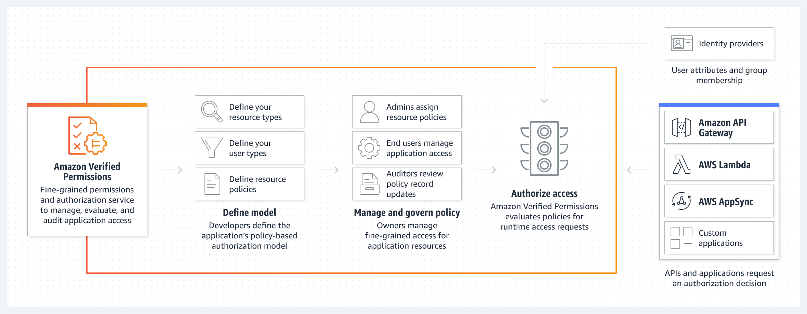
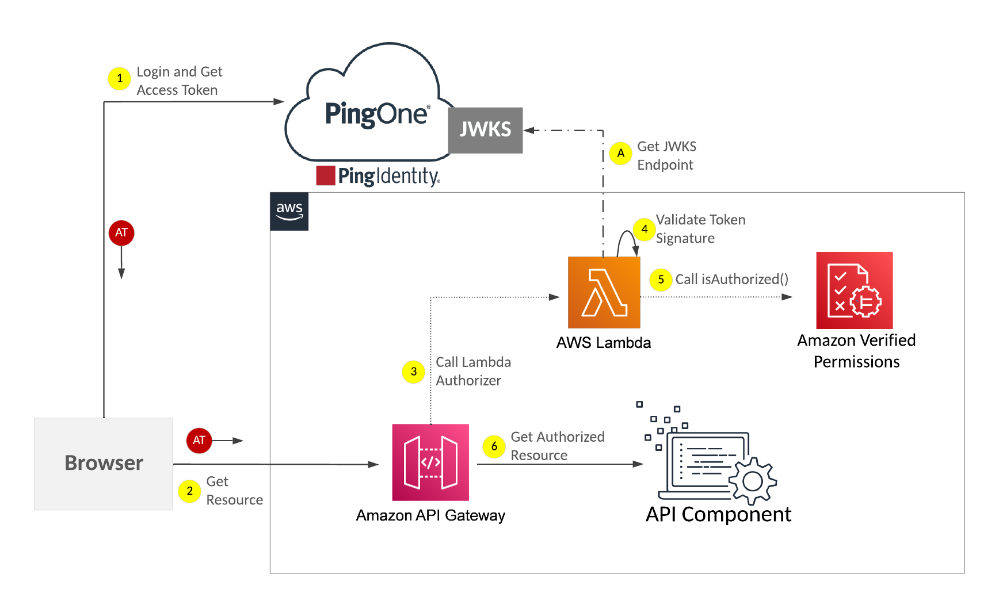

# PingOne Integration with Amazon Verified Permissions

### Amazon Verified Permissions
Amazon Verified Permissions is a scalable, fine-grained permissions management and authorization service for custom applications. The service centralizes fine-grained permissions for custom applications and helps developers authorize user actions within applications. Amazon Verified Permissions uses the Cedar policy language to define fine-grained permissions for application users.




### PingOne Identity Provider for Amazon Verified Permissions

PingOne operates as the Identity Provider (IdP), providing authentication capabilities for Amazon Verified Permissions via Lambda Authorizers. The PingOne Lambda Authorizer Python script is available here: [https://github.com/pingone-davinci/pingone-avp-lambda-authorizer]

The diagram below illustrates the process flow of a user authenticating with PingOne :





## Requirements
* PingOne Tenant
* Amazon API Gateway
* Amazon Verified Permissions 


## Before you begin
* From the PingOne Console:


* From the AWS Console:


  * Sample Cedar Policy:


```
permit (
    principal == User::"b45670e9-11e5-4f4d-b00c-aa60acc6f2dd",
    action in [Action::"POST"],
    resource == Resource::"protected-resource"
);
```


## Steps

### Configure AWS Lambda Environment Variables
- Add the variable `AWS_DATA_PATH` with the value `./models` to use the service data model.


### Summary

After the configuration has been completed, PingOne will function as an Identity Provider for your Amazon API Gateway.


### Appendix: